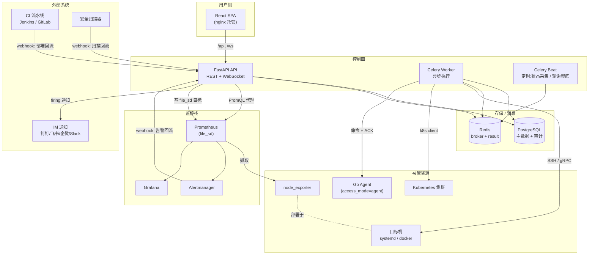
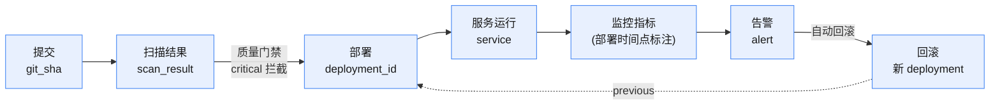
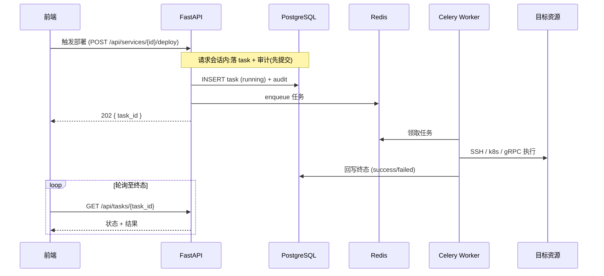

# 一脉 Axon 统一运维控制面

企业级统一运维控制台。把 **提交 → 扫描 → 部署 → 监控 → 告警** 用 `service` / `git_sha` / `deployment_id` 三个关联键串成一条可回溯的交付链路,聚焦"交付态可追溯"。

一处触发部署,即可回答:这次上线部署的是哪个 commit、扫过什么漏洞、发布后 CPU 涨没涨、出问题能不能一键回滚。

---

## 能力总览

| 域 | 能力 |
|----|------|
| **运行态** | 服务器纳管(SSH/Agent)、服务生命周期(启停/重启/删除)、三 runtime 适配(systemd / docker / k8s) |
| **监控** | 状态采集(SSH 轮询)、node_exporter 自举 + Prometheus file_sd 登记、PromQL 查询代理、Grafana 面板 |
| **部署** | UI 触发部署、CI 回流 webhook、一键回滚、环境晋升(promotion)、发布策略(rolling / recreate) |
| **配置** | 配置版本化、下发到目标机(`${secret:}` 注入 + reload/restart)、配置回滚 |
| **交付关联** | 扫描回流 + 质量门禁(critical 拦截)、全链路关联查询、部署时间点标注 |
| **告警** | 告警回流 webhook、查询过滤、告警触发自动回滚、IM 通知触达 |
| **治理** | 生产审批流(四眼原则)、审计日志、JWT 鉴权 + 按环境的操作权限 |
| **Agent** | 控制面侧就绪:连接管理、断连一致性决策、fencing token 防双执行(Go Agent 本体与 gRPC wire 为独立交付物) |

---

## 技术栈

**后端** FastAPI · SQLAlchemy 2.0 (async) · Alembic · Celery + Redis · PostgreSQL

**前端** React 18 + TypeScript · Vite · Ant Design(定制主题) · TanStack Query · Zustand · ECharts

**监控** Prometheus · node_exporter · Alertmanager · Grafana

**Agent** Go + gRPC(独立交付物,控制面侧抽象已就绪)

数据库通过单个环境变量 `YIMAI_DATABASE_URL` 切换,代码零改动即可在 PostgreSQL / SQLite / MySQL 间切(详见[使用与部署 §5](docs/使用与部署.md))。

---

## 系统架构

### 组件与部署拓扑



### 全链路关联(核心价值)

三个关联键把割裂的环节串成一条可回溯链路:



- `service`：贯穿运行态、部署、配置、监控、告警的主体。
- `git_sha`：连接提交、扫描结论与部署制品,门禁据此拦截高危漏洞。
- `deployment_id`：每次部署/回滚的唯一记录,回滚链通过 `previous` 指针闭环。

### 异步动作模式

所有写操作(部署/回滚/生命周期/配置下发)统一走"落 task → 异步执行 → 前端轮询"模式,避免长阻塞:



> prod 高危操作先落 pending 审批(四眼原则),approve 后才建 task 走上述编排。

---

## 目录结构

```
统一运维控制面/
├── backend/                # FastAPI 后端
│   ├── app/
│   │   ├── main.py         # 应用工厂 + lifespan(依赖装配:secret/pipeline/k8s/agent)
│   │   ├── api/            # 路由:auth/servers/services/deployments/webhooks/alerts...
│   │   ├── services/       # 业务编排:部署/生命周期/回滚/配置下发/健康检查/告警...
│   │   ├── adapters/       # 外部适配:ssh/systemd/docker/k8s/pipeline/prometheus/agent
│   │   ├── models/         # SQLAlchemy 模型
│   │   ├── core/           # config/db/errors/security/middleware/secrets/ws_hub
│   │   ├── workers/        # Celery app + 定时任务(状态采集/部署对账)
│   │   └── cli/            # seed 等命令
│   ├── alembic/            # 数据库迁移
│   ├── proto/ + grpc_gen/  # Agent gRPC 契约与生成代码
│   └── tests/              # 测试(独立目录,严格 TDD)
├── frontend/               # React + Vite 前端
│   └── src/
│       ├── pages/          # 各功能页(服务器/服务/部署/配置/监控/告警/审批)
│       ├── api/            # 接口封装 + 生成的 schema.d.ts
│       ├── components/     # 复用组件
│       └── stores/         # Zustand 状态
├── agent/                  # Go Agent 本体(独立交付物)
├── ops/                    # 监控栈配置(prometheus/alertmanager/grafana)
├── docs/                   # 使用与部署指南
├── docker-compose.yml      # 本地全栈一键编排
└── Makefile                # 常用命令封装(make help)
```

---

## 快速开始

### Docker 一键全栈(最快)

```bash
cp .env.example .env          # 按需改端口 / 密码 / 密钥
make up                       # 等价 docker compose up -d --build
make ps                       # 看状态
```

访问:前端 http://localhost:5173 · 后端 http://localhost:8000/docs · Flower :5555 · Prometheus :9090 · Grafana :3000(admin/admin) · Alertmanager :9093

compose 已编排启动顺序:`migrate` 服务先跑迁移,api/worker 等其成功后再启,避免建表竞态。

### 本地开发

```bash
# 后端
cd backend
uv sync                            # 装依赖(读 uv.lock 可复现)
uv run alembic upgrade head        # 建表
uv run python -m app.cli.seed      # 灌管理员(默认 admin/admin,登录后立即改密)
uv run uvicorn app.main:app --reload --port 8000

# 前端(另开终端)
cd frontend
npm install
npm run dev                        # http://localhost:5173

# 异步任务(部署/回滚/状态采集)
cd backend
uv run celery -A app.workers.celery_app worker --loglevel=info
uv run celery -A app.workers.celery_app beat   --loglevel=info
```

Makefile 封装:`make backend-dev` / `make frontend-dev` / `make migrate` / `make seed` / `make test`。

---

## 测试

```bash
make backend-test     # cd backend && uv run pytest tests/ --cov=app
make frontend-test    # cd frontend && npm run test
```

后端严格 TDD,测试放独立 `tests/` 目录、与正式代码物理分离;前端每页过"反 AI 感清单"。

---

## 配置

后端全部配置项前缀 `YIMAI_`,定义见 `backend/app/core/config.py`;复制 `.env.example` 为 `.env` 修改。生产必设的关键项:

| 变量 | 说明 |
|------|------|
| `YIMAI_DATABASE_URL` | 数据库 DSN(切库唯一开关) |
| `YIMAI_REDIS_URL` | Celery broker / result backend |
| `YIMAI_JWT_SECRET` | JWT 签名密钥(32 字节+) |
| `YIMAI_SECRET_MASTER_KEY` | 保险箱主密钥(加密 SSH 私钥 / 平台 token,经 KMS 注入,勿入库/入镜像) |
| `YIMAI_WEBHOOK_SECRETS` | 各来源 webhook 的 HMAC secret(缺省为空 = 全拒) |
| `YIMAI_CORS_ORIGINS` | CORS 白名单 |
| `YIMAI_REQUIRE_PROD_APPROVAL` | prod 部署审批开关(默认开) |

> **安全约束**:镜像里不塞密钥,一律经部署平台 secret 机制注入;入向 webhook 走 HMAC 验签 + 时间窗 + 幂等键。

---

## 文档

- [使用与部署指南](docs/使用与部署.md) — 本地起步、手动/Docker 打包部署、切库、运维流程速查、常见问题
